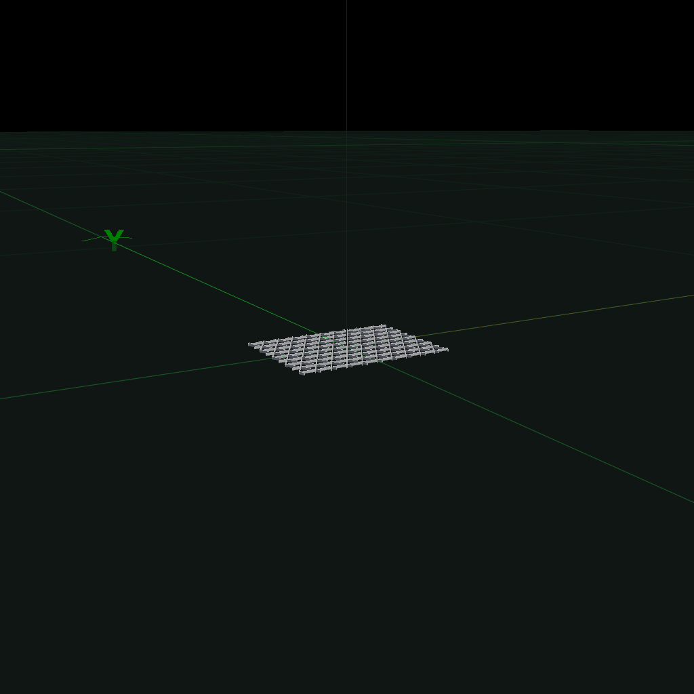
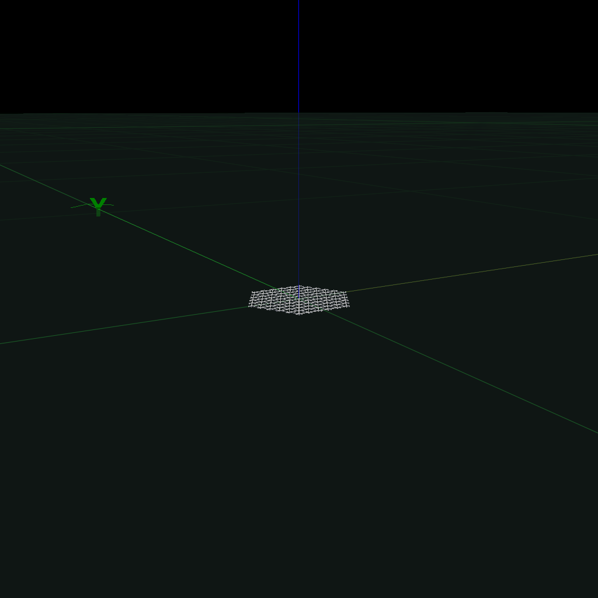
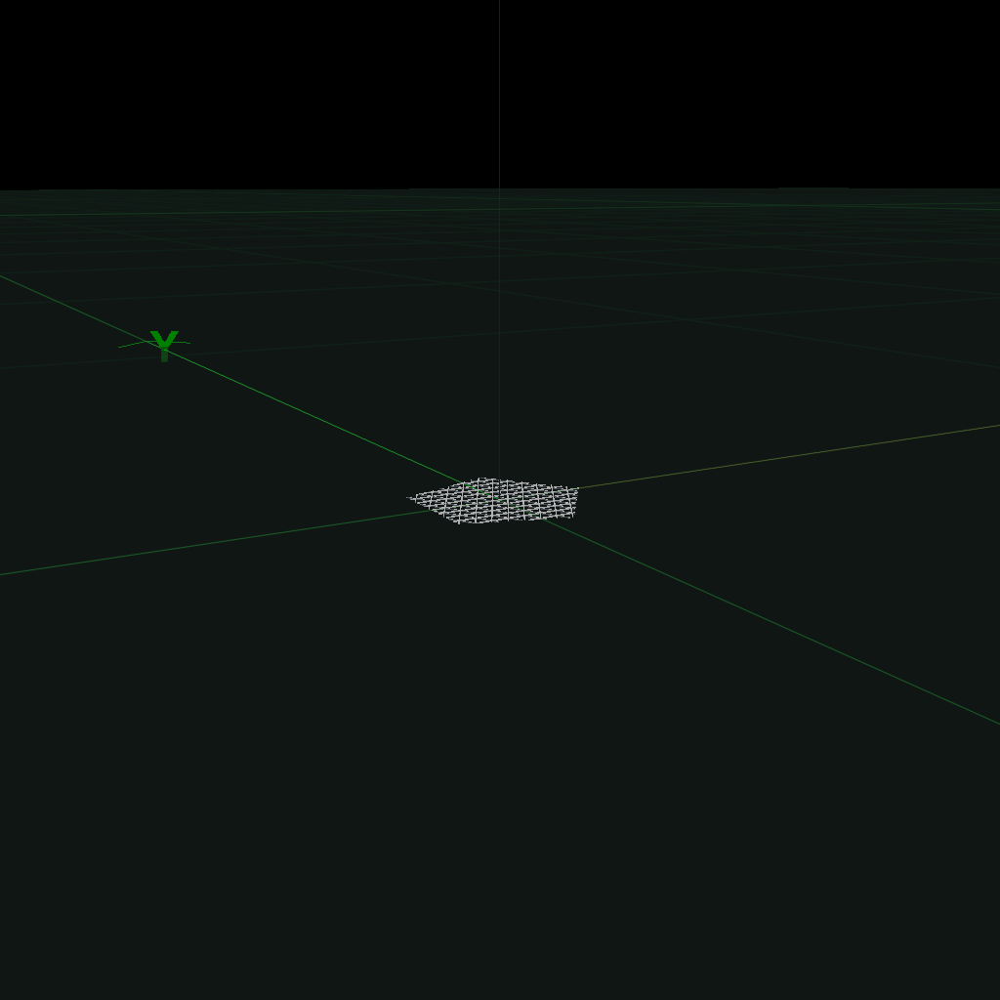
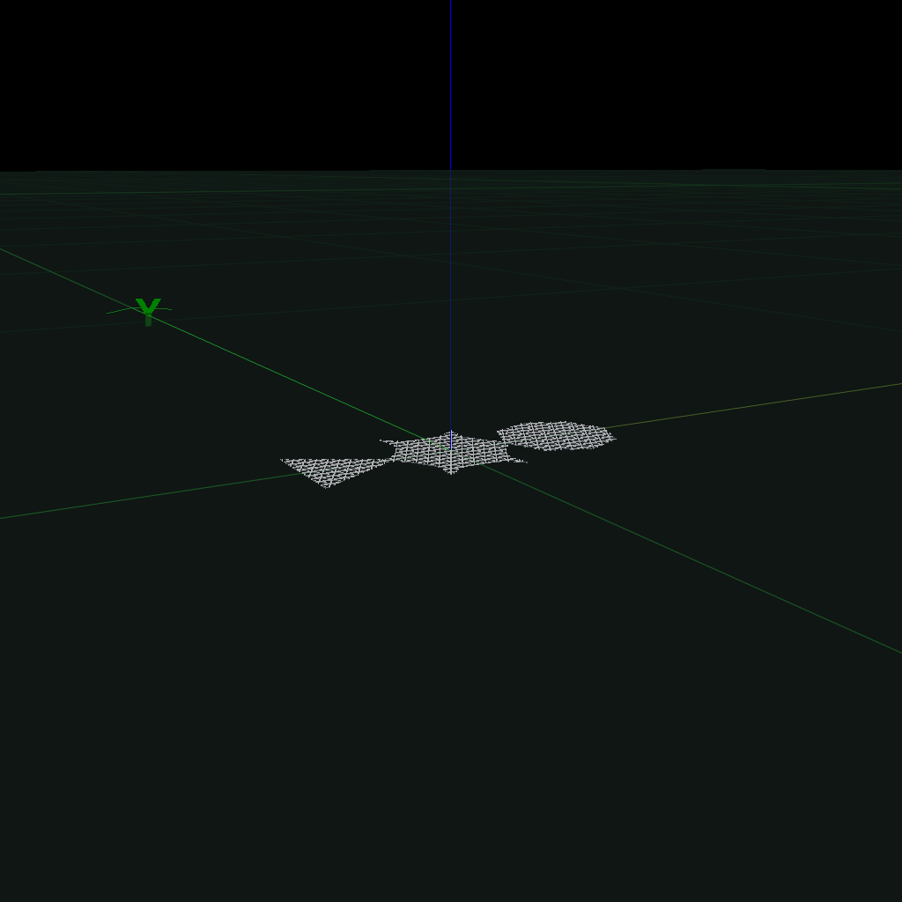
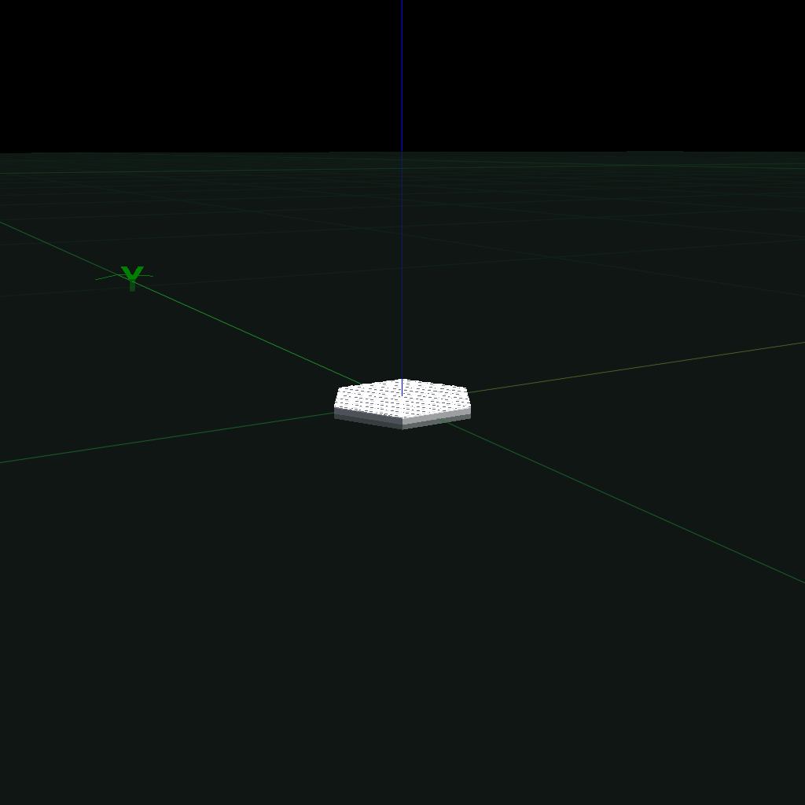
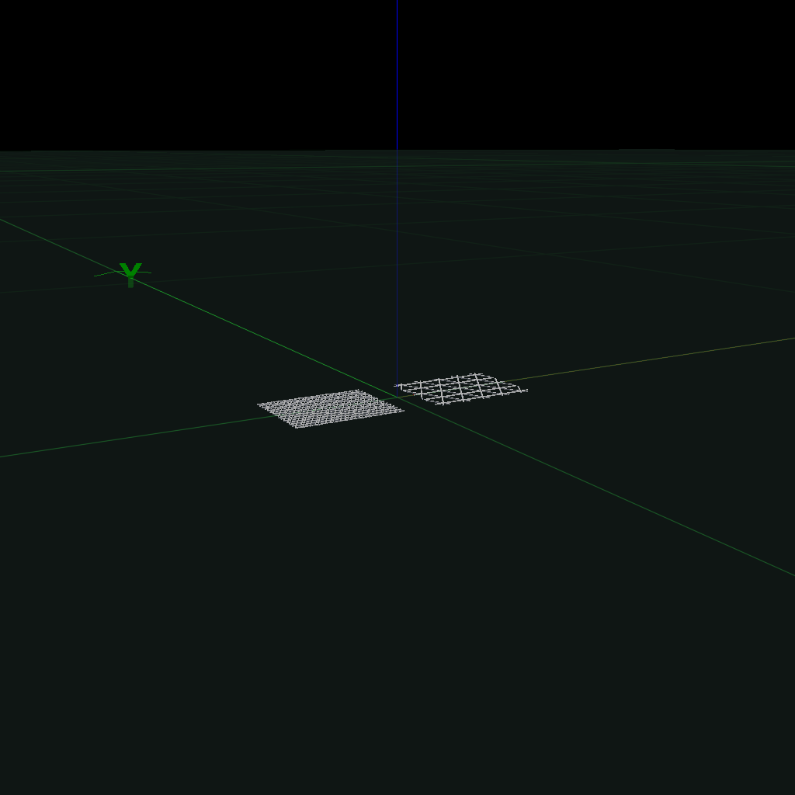
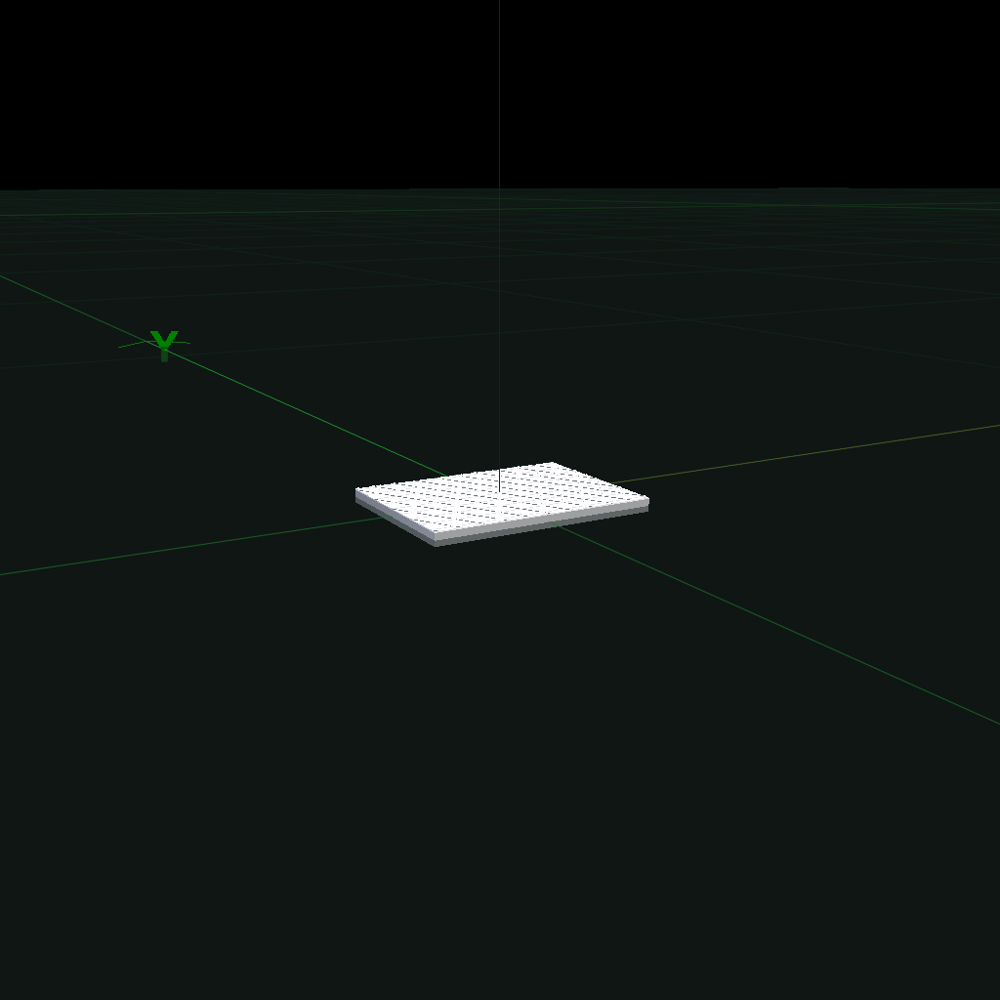
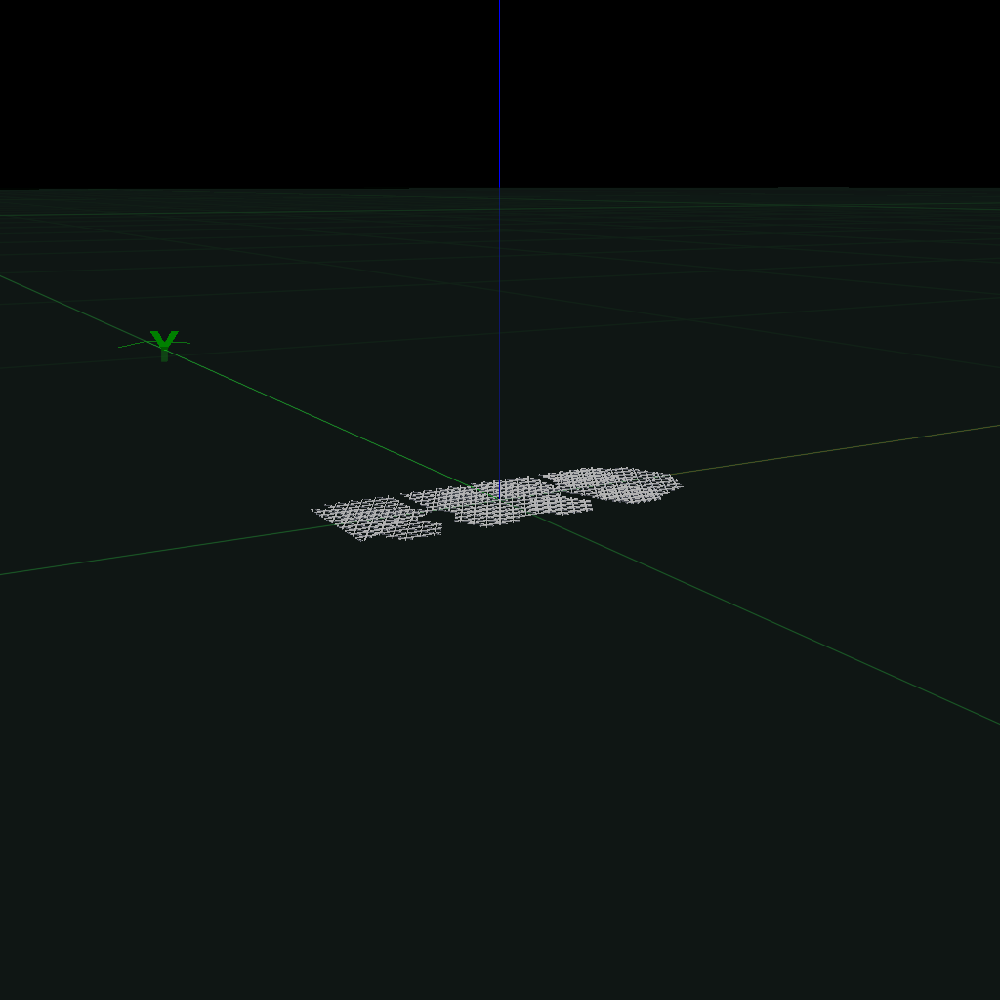
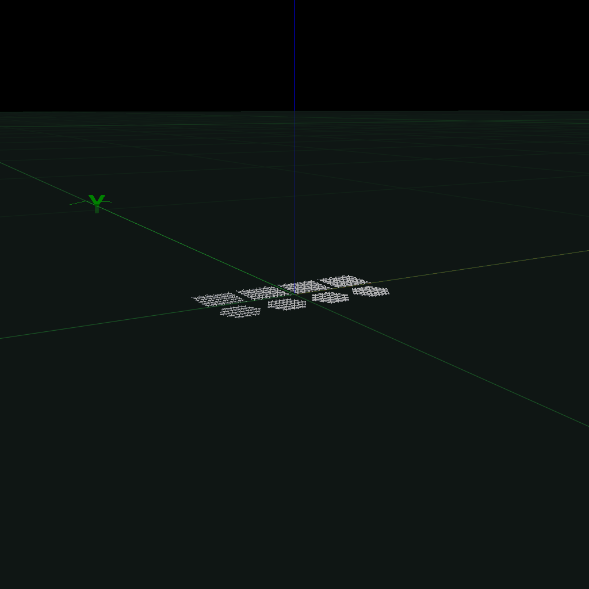

# IsoGridScad

OpenSCAD library for generating isometric grid (isogrid) patterns on 2D and 3D objects.

## Overview

IsoGridScad provides parametric isogrid pattern generation for both rectangular and arbitrary polygonal shapes. Isogrids are triangular lattice structures commonly used in aerospace and engineering for lightweight, high-strength panels. This library makes it easy to add these patterns to your OpenSCAD designs.

**Key Features:**
- ✨ Pure OpenSCAD implementation (no BOSL2 required for core functionality)
- 📐 Support for rectangles and arbitrary polygons
- 🎯 Fully parametric: control triangle size, line thickness, and extrusion depth
- 🔗 Compatible with BOSL2 attachments for easy integration
- 🎨 Generate 2D patterns or 3D extruded geometry

## Installation

1. Copy `isogrid.scad` to your project directory
2. Include or use it in your OpenSCAD file:

```openscad
use <isogrid.scad>
```

For BOSL2 attachment support (optional), also include:
```openscad
include <BOSL2/std.scad>
use <isogrid.scad>
```

## Quick Start

### Basic Rectangular Isogrid

```openscad
use <isogrid.scad>

isogrid_rect(200, 150, triangle_size=20, thickness=1, extrude=1);
```


### 3D Extruded Rectangular Isogrid

```openscad
use <isogrid.scad>

isogrid_rect(200, 150, triangle_size=20, thickness=1, extrude=3);
```



### Polygon Examples

**Hexagon:**

```openscad
include <BOSL2/std.scad>
use <isogrid.scad>

function regular_polygon(sides, radius) =
    [for (i = [0:sides-1]) [radius * cos(i * 360 / sides), radius * sin(i * 360 / sides)]];

isogrid_polygon(regular_polygon(6, 80), triangle_size=15, thickness=1, extrude=1);
```



**Pentagon:**

```openscad
include <BOSL2/std.scad>
use <isogrid.scad>

function regular_polygon(sides, radius) =
    [for (i = [0:sides-1]) [radius * cos(i * 360 / sides), radius * sin(i * 360 / sides)]];

isogrid_polygon(regular_polygon(5, 80), triangle_size=15, thickness=1, extrude=1);
```



**Star Shape:**

```openscad
include <BOSL2/std.scad>
use <isogrid.scad>

function regular_polygon(sides, radius) =
    [for (i = [0:sides-1]) [radius * cos(i * 360 / sides), radius * sin(i * 360 / sides)]];

points = 6; outer_r = 80; inner_r = 40;
star = [for (i=[0:2*points-1]) 
    let(r=(i%2==0)?outer_r:inner_r, ang=i*180/points) 
    [r*cos(ang), r*sin(ang)]];
isogrid_polygon(star, triangle_size=12, thickness=1, extrude=1);
```



**Multiple Shapes Comparison:**

```openscad
include <BOSL2/std.scad>
use <isogrid.scad>

function regular_polygon(sides, radius) =
    [for (i = [0:sides-1]) [radius * cos(i * 360 / sides), radius * sin(i * 360 / sides)]];

translate([-120, 0]) 
    isogrid_polygon(regular_polygon(3, 60), triangle_size=12, thickness=1, extrude=1);
translate([0, 0]) 
    isogrid_polygon(regular_polygon(6, 60), triangle_size=12, thickness=1, extrude=1);
translate([120, 0]) 
    isogrid_polygon(regular_polygon(8, 60), triangle_size=12, thickness=1, extrude=1);
```



### Attached to 3D Objects (BOSL2)

**Box with Rectangle:**

```openscad
include <BOSL2/std.scad>
use <isogrid.scad>

cuboid([200,150,12], anchor=CENTER) 
    attach(TOP) 
        isogrid_rect(200, 150, triangle_size=20, thickness=1.5, extrude=1);
```



**Hexagonal Cylinder with Hexagon:**

```openscad
include <BOSL2/std.scad>
use <isogrid.scad>

function regular_polygon(sides, radius) =
    [for (i = [0:sides-1]) [radius * cos(i * 360 / sides), radius * sin(i * 360 / sides)]];

cyl(h=12, d=160, anchor=CENTER, $fn=6)
    attach(TOP)
        isogrid_polygon(regular_polygon(6, 80), triangle_size=15, thickness=1.5, extrude=1);
```



## API Reference

### `isogrid_rect()`

Generate an isogrid pattern within a rectangular boundary.

**Parameters:**
- `width` - Width of the rectangle (required)
- `height` - Height of the rectangle (required)
- `triangle_size` - Side length of individual triangles (default: 10)
- `thickness` - Thickness of the grid lines (default: 1)
- `extrude` - Height to extrude in Z direction; 0 for 2D (default: 0)

**Examples:**

```openscad
// Fine detail pattern
isogrid_rect(200, 150, triangle_size=10, thickness=0.8, extrude=1);

// Thick structural pattern
isogrid_rect(200, 150, triangle_size=20, thickness=2, extrude=3);

// Wide panel
isogrid_rect(300, 100, triangle_size=20, thickness=1, extrude=1);
```

**Notes:**
- The pattern is centered at the origin
- Triangle size determines density: smaller = finer detail
- Thickness affects line width and structural strength
- Set `extrude=0` for 2D laser cutting patterns

### `isogrid_polygon()`

Generate an isogrid pattern within an arbitrary polygon boundary.

**Parameters:**
- `polygon` - List of [x,y] points defining the polygon boundary (required)
- `triangle_size` - Side length of individual triangles (default: 10)
- `thickness` - Thickness of the grid lines (default: 1)
- `extrude` - Height to extrude in Z direction; 0 for 2D (default: 0)

**Examples:**

```openscad
// Helper function for regular polygons
function regular_polygon(sides, radius) =
    [for (i = [0:sides-1]) [radius * cos(i * 360 / sides), radius * sin(i * 360 / sides)]];

// Pentagon
isogrid_polygon(regular_polygon(5, 80), triangle_size=15, thickness=1, extrude=1);

// Octagon
isogrid_polygon(regular_polygon(8, 80), triangle_size=15, thickness=1, extrude=1);

// Irregular polygon
custom = [[0,0], [100,20], [120,80], [80,120], [20,100], [-20,40]];
isogrid_polygon(custom, triangle_size=15, thickness=1, extrude=1);

// Star shape
points = 6; outer_r = 80; inner_r = 40;
star = [for (i=[0:2*points-1]) 
    let(r=(i%2==0)?outer_r:inner_r, ang=i*180/points) 
    [r*cos(ang), r*sin(ang)]];
isogrid_polygon(star, triangle_size=12, thickness=1, extrude=1);
```

**Notes:**
- Polygon must be a simple (non-self-intersecting) polygon
- Points should be ordered consecutively (clockwise or counter-clockwise)
- The pattern is clipped precisely to the polygon boundary
- Works with any convex or concave simple polygon

## Advanced Usage

### Thickness Variations

Create different structural densities by varying line thickness:

```openscad
include <BOSL2/std.scad>
use <isogrid.scad>

function regular_polygon(sides, radius) =
    [for (i = [0:sides-1]) [radius * cos(i * 360 / sides), radius * sin(i * 360 / sides)]];

for(i=[0:3]) {
    translate([i*70-105, 30]) 
        isogrid_rect(60, 60, triangle_size=12, thickness=0.5+i*0.5, extrude=1);
    translate([i*70-105, -40]) 
        isogrid_polygon(regular_polygon(6,30), triangle_size=12, thickness=0.5+i*0.5, extrude=1);
}
```



Shown with thickness values of 0.5, 1.0, 1.5, and 2.0mm.

### Density Variations

Control pattern density with triangle size:

```openscad
use <isogrid.scad>

translate([-80, 0]) 
    isogrid_rect(120, 100, triangle_size=8, thickness=0.6, extrude=1);
translate([80, 0]) 
    isogrid_rect(120, 100, triangle_size=25, thickness=1.5, extrude=1);
```



Fine grid (left, triangle_size=8) vs coarse grid (right, triangle_size=25).

### 2D Patterns for Laser Cutting

Set `extrude=0` to generate 2D patterns suitable for laser cutting:

```openscad
// Export as 2D pattern
isogrid_rect(400, 300, triangle_size=20, thickness=1.5, extrude=0);

// Save as DXF: File → Export → Export as DXF
```

## Design Guidelines

### Choosing Parameters

**Triangle Size:**
- **5-10mm**: Fine detail, decorative panels, small parts
- **10-20mm**: General purpose, good balance of strength and weight
- **20-40mm**: Structural panels, large format parts

**Thickness:**
- **0.5-1.0mm**: Lightweight, decorative, non-structural
- **1.0-2.0mm**: General purpose, light structural loads
- **2.0-4.0mm**: Heavy structural loads, high strength

**Extrusion Depth:**
- **0-1mm**: Surface detail, thin reinforcement
- **1-3mm**: Moderate structural depth
- **3-10mm**: Deep structural ribs, high strength

### Performance Tips

1. **Rendering Speed**: Larger triangle sizes render faster
2. **Printability**: Ensure thickness ≥ 2× your nozzle diameter for 3D printing
3. **Strength**: Triangle size should scale with panel dimensions
4. **Aspect Ratio**: For rectangles, consider triangle size relative to both dimensions

### Common Use Cases

- **Aerospace panels**: Lightweight structural panels
- **Cases and enclosures**: Ventilated side panels with style
- **Decorative elements**: Cyberpunk/sci-fi aesthetic details
- **Weight reduction**: Remove material while maintaining strength
- **Heat dissipation**: Open lattice for airflow

## Testing

The `isogrid_test.scad` file includes comprehensive tests demonstrating all features:

```openscad
// Run all tests
render_all_tests();

// Run individual tests
test_rect_basic();
test_poly_hex();
test_thickness_variation();
test_3d_attached_duo();
```

## Technical Details

### Pattern Generation

The library generates three sets of parallel lines at 0°, 60°, and -60° from horizontal, which intersect to form equilateral triangles. The spacing between parallel lines is calculated as:

```
h = triangle_size × √3 / 2
```

This ensures perfectly equilateral triangles in the resulting isogrid pattern.

### Coordinate System

- Patterns are centered at the origin
- Z-axis is up for extrusion
- BOSL2 attachments follow standard anchor/spin conventions

## Examples Gallery

See `isogrid_test.scad` for comprehensive examples including:
- Basic rectangular patterns
- Various polygon shapes (hexagon, pentagon, octagon, triangle)
- Irregular and star-shaped polygons
- Thickness and density variations
- 3D attachments to objects
- Scale progressions

## License

MIT License - See [LICENSE.txt](LICENSE.txt) for details.

Copyright (c) 2025

## Contributing

Contributions welcome! Please test changes with `isogrid_test.scad` before submitting.

## Version History

- **v1.0.0**: Initial release with `isogrid_rect()` and `isogrid_polygon()`
